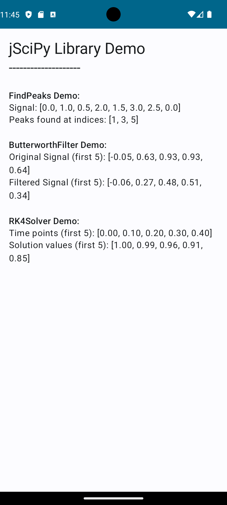

# jscipy-app

This is an Android application that serves as a demonstration for the `jSciPy` library, specifically showcasing its signal processing capabilities within a mobile environment. The project is hosted at `https://github.com/hissain/jscipy-android.git`.

## jSciPy Library Overview

The `jSciPy` library provides scientific computing functionalities, mirroring the capabilities of Python's SciPy, but implemented for Java/Kotlin environments. This sample application integrates and demonstrates key modules from `jSciPy.signal`, highlighting their practical application in signal analysis and processing.

### Demonstrated Modules from `jSciPy.signal`

-   **FindPeaks**: This module is utilized for robust detection of peaks within a given one-dimensional signal. The demonstration in `MainActivity.kt` illustrates how to identify local maxima based on configurable parameters such as `distance` (minimum number of samples between peaks) and `height` (required amplitude of peaks). This is crucial for applications requiring event detection or feature extraction from time-series data.

-   **ButterworthFilter**: Implements a Butterworth digital filter, a type of signal processing filter designed to have a maximally flat frequency response in the passband. The `MainActivity.kt` example showcases the `filtfilt` method, which applies a zero-phase digital filter by filtering the signal in both forward and reverse directions. This effectively eliminates phase distortion introduced by the filter, making it suitable for precise signal conditioning. Parameters such as `sampleRate`, `cutoff` frequency, and filter `order` are demonstrated.

-   **RK4Solver**: Provides an implementation of the Runge-Kutta 4th order method, a widely used numerical technique for approximating solutions to ordinary differential equations (ODEs). The demo illustrates solving a first-order ODE `dy/dt = f(t, y)` given an initial condition `y0` at `t0`, over a specified time interval `[t0, tf]` with a given step size `h`. This is fundamental for simulating dynamic systems and modeling various scientific phenomena.

## Project Structure and Technologies

This project is a standard Android application developed with Kotlin and built using Gradle. It leverages Jetpack Compose for its declarative UI, ensuring a modern and responsive user experience.

-   **Android Configuration**:
    -   `namespace`: `com.hissain.samplejscipyapp`
    -   `compileSdk`: `34` (Android 14)
    -   `minSdk`: `24` (Android 7.0 Nougat)
    -   `targetSdk`: `34` (Android 14)
    -   `kotlinCompilerExtensionVersion`: `1.5.1` for Jetpack Compose.

-   **Key Directories**:
    -   `app/src/main/java/com/hissain/samplejscipyapp/`: Contains the core Kotlin source code. `MainActivity.kt` is the entry point, demonstrating the integration and usage of `jSciPy` functionalities within composable UI elements.
    -   `app/src/main/java/com/hissain/samplejscipyapp/ui/theme/`: Defines the application's UI theme, including `Color.kt`, `Theme.kt`, and `Type.kt` for consistent styling.
    -   `app/src/main/res/`: Houses Android resources such as drawables (`ic_launcher_background.xml`, `ic_launcher_foreground.xml`), mipmaps for launcher icons, and values (`strings.xml`, `themes.xml`) for localization and styling.

-   **Dependencies**:
    -   `com.github.hissain:jscipy:1.0.2`: The primary dependency for `jSciPy` library integration.
    -   `androidx.activity:activity-compose:1.7.0`: For Compose integration with `ComponentActivity`.
    -   `androidx.compose.ui:*`, `androidx.compose.material3:material3`: Jetpack Compose UI toolkit components.
    -   `androidx.lifecycle:lifecycle-runtime-ktx:2.6.1`: Kotlin extensions for Lifecycle-aware components.

## Getting Started

To build and run this project, you will need Android Studio and the Android SDK (API Level 34 or higher recommended).

1.  **Clone the repository**:
    ```bash
    git clone https://github.com/hissain/jscipy-android.git
    ```
2.  **Open in Android Studio**: Launch Android Studio and open the cloned project. Gradle will automatically sync dependencies.
3.  **Build and Run**: Build the project and deploy it to an Android emulator or a physical device. The application will launch, displaying a simple UI that visually demonstrates the `FindPeaks`, `ButterworthFilter`, and `RK4Solver` functionalities with example data and their respective outputs.

## Screenshot

Here's a screenshot of the application in action, illustrating the output of the `jSciPy` demos:



## License

This project is licensed under the Apache License 2.0. See the [LICENSE](LICENSE) file for details.
