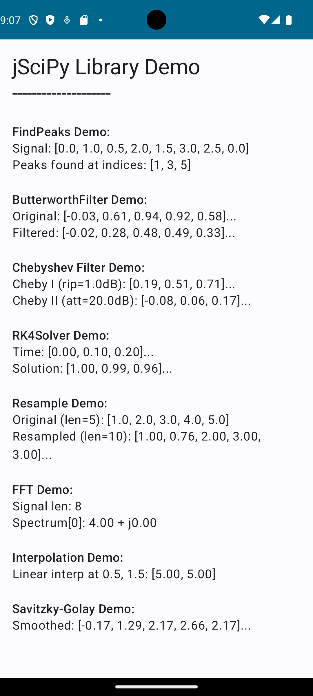

# jSciPy Sample App

This Android application demonstrates the capabilities of the `jSciPy` library, a Java/Kotlin port of SciPy's signal processing and scientific computing modules.

## Features Demonstrated

This app provides interactive examples for the following `jSciPy` modules:

### Spectral Analysis (New)
*   **Periodogram**: Power Spectral Density estimation.
*   **Spectrogram**: Time-frequency analysis.
*   **2D FFT**: Two-dimensional Fast Fourier Transform.

### Filters
*   **Butterworth Filter**: Low-pass, high-pass, band-pass, and band-stop filtering (including zero-phase `filtfilt`).
*   **Chebyshev Filters**: Type I and Type II filters with ripple/attenuation control.
*   **Savitzky-Golay Filter**: Smoothing and differentiation of data.

### Signal Processing
*   **Find Peaks**: Peak detection in signals.
*   **Resample**: Signal resampling using Fourier method.
*   **Detrend**: Removing linear or constant trends.
*   **FFT**: Fast Fourier Transform operations.
*   **Hilbert Transform**: Analytic signal computation.

### Math & Interpolation
*   **RK4 Solver**: Solving Ordinary Differential Equations (ODEs).
*   **Interpolation**: Linear and cubic spline interpolation.

## Getting Started

1.  Clone the repository.
2.  Open in Android Studio.
3.  Build and Run on an emulator or device.

The app displays a scrollable list of demos, each showing input data and the processed output using `jSciPy`.

## Dependencies

*   `com.hissain.jscipy:jscipy:3.1.3` (Included in `app/libs`)
*   Jetpack Compose for UI

## Screenshot

## License

Apache License 2.0
